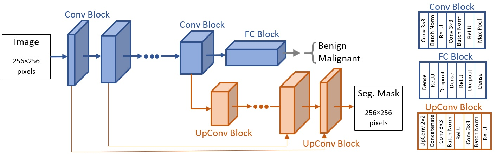

# Evaluation-of-Complexity-Measures-for-Deep-Learning-Generalization-in-Medical-Image-Analysis

The codes in this repository are based on our empirical study that investigates the correlation between complexity measures and generalization abilities of supervised deep learning classifiers for breast ultrasound images. The study is presented in the paper <a href="https://arxiv.org/abs/2103.03328">Evaluation of Complexity Measures for Deep Learning Generalization in Medical Image Analysis</a>.

The performance of deep learning models for medical image analysis often decreases on images collected with different devices for data acquisition, device settings, or patient population. A better understanding of the generalization capacity on new images is crucial for clinicians’ trustworthiness in deep learning. Although significant research efforts have been recently directed toward establishing generalization bounds and complexity measures, still, there is often a significant discrepancy between the predicted and actual generalization performance. In addition, related large empirical studies (e.g., <a href="https://arxiv.org/abs/1912.02178">Jiang et al. (2019)</a>, <a href="https://arxiv.org/abs/2010.11924">Dziugaite et al. (2020)</a>) have been primarily based on validation with general-purpose image datasets. 

In our empirical study, we evaluate the correlation between 25 complexity measures (adopted from <a href="https://arxiv.org/abs/2010.11924">Dziugaite et al. (2020)</a>) and generalization behavior of a family of deep learning networks on breast ultrasound images, using two types of predictor tasks: (i) classification, and (ii) joint classification and segmentation. In controlled experiment settings, we vary the depth of the networks to analyze generalization performance. The results indicate that PAC-Bayes flatness-based and path norm-based measures produce the most consistent explanation for the combination of models and data. Furthermore, the comparative results show improved generalization by the multi-task approach on both i.i.d. and o.o.d images. 

# Codes
Jupyter notebooks, the deep learning models are implemented in PyTorch. The implementation of complexity measures is from <a href="https://github.com/nitarshan/robust-generalization-measures">https://github.com/nitarshan/robust-generalization-measures</a>.
* <a href="Experiment_1.ipynb">Single-task classification model without regularization</a> [<a href="https://nbviewer.jupyter.org/github/avakanski/Evaluation-of-Complexity-Measures-for-Deep-Learning-Generalization-in-Medical-Image-Analysis/blob/main/Experiment_1.ipynb">on nbviewer</a>] - the network does not have regularization layers (batch normalization or dropout)and it is trained to full convergence, i.e., until achieving a training error of 0.01.
* <a href="Experiment_2.ipynb">Single-task classification model with regularization</a> [<a href="https://nbviewer.jupyter.org/github/avakanski/Evaluation-of-Complexity-Measures-for-Deep-Learning-Generalization-in-Medical-Image-Analysis/blob/main/Experiment_2.ipynb">on nbviewer</a>] - the network applies implicit regularization via batch normalization and dropout layers,and it is trained with early stopping until a non-decreasing cross-entropy loss on a validation subset of images is achieved.
* <a href="Experiment_3.ipynb">Multi-task classification and segmentation model with regularization</a> [<a href="https://nbviewer.jupyter.org/github/avakanski/Evaluation-of-Complexity-Measures-for-Deep-Learning-Generalization-in-Medical-Image-Analysis/blob/main/Experiment_3.ipynb">on nbviewer</a>] - the network consists of classification and segmentation branches, and it is trained until non-increasing classification accuracy on a validation subset of images is achieved.

# Complexity Measures
The following set of complexity measures is evaluated:
* VC dimension-based measure - number of network parameters. 
* Output-based measure - inverse of the squared margin of output logits.
* Spectral norm-based measures - seven measures are used, derived using sums, products, and margin-normalized spectral norms of the network parameters. 
* Frobenius norm-based measures - seven measures are used that similarly to the spectral measures are derived using Frobenius norms of the network parameters.
* Path-based measures - two measures are reported, calculated
as the outputs to all-one inputs with squared parameters.
* Flatness-based measures - are based on PAC-Bayes theory and estimate the flatness of the loss landscape in the vicinity of the solution for the network parameters. Six complexity measures are used.
* Optimization-based measure - employs the number of iterations for achieving a classification error of 0.01 or 0.1.

# Data
This repository uses an open public dataset of breast ultrasound images known as <a href="https://ieeexplore.ieee.org/document/8003418">Dataset B</a> for implementing the proposed approach. The implementation in this repository is different from the empirical study presented in the paper, which is based on larger datasets of breast ultrasound images as well as larger number of trained models. 
* Images - the dataset consists of 163 breast ultrasound images.
* Masks - segmentation masks corresponding to the images, used for multi-task learning.
* Labels - excel file with labels for the tumor type in images (benign or malignant).

# Network Architecture
The architecture of the evaluated networks is shown in the following figure. Single-task learning models employ a VGG-like classification branch which consists of a series of blocks with convolutional and max-pooling layers, followed by fully-connected layers. Multi-task learning models perform joint classification and segmentation, by adding a U-Net-like decoder to the encoder of the classification branch.

# Citation
If you use the codes in this repository, please cite the following <a href="https://arxiv.org/abs/2103.03328">article</a>:   

    @ARTICLE{Vakanski2021,
    title={Evaluation of Complexity Measures for Deep Learning Generalization in Medical Image Analysis},
    author={Vakanski, A. and Xian, M.},
    year={2021},
    month={Mar.},
    archivePrefix = {arXiv},
    eprint = {2103.03328},
    journal = {CoRR},
    primaryClass = {comp-sci},
    ee = {https://arxiv.org/abs/2103.03328},
    }

# License
<a href="License - MIT.txt">MIT License</a>

# Acknowledgments
This work was supported by the <a href="https://imci.uidaho.edu/get-involved/about-cmci/">Institute for Modeling Collaboration and Innovation (IMCI)</a> at the University of Idaho through NIH Award #P20GM104420.
